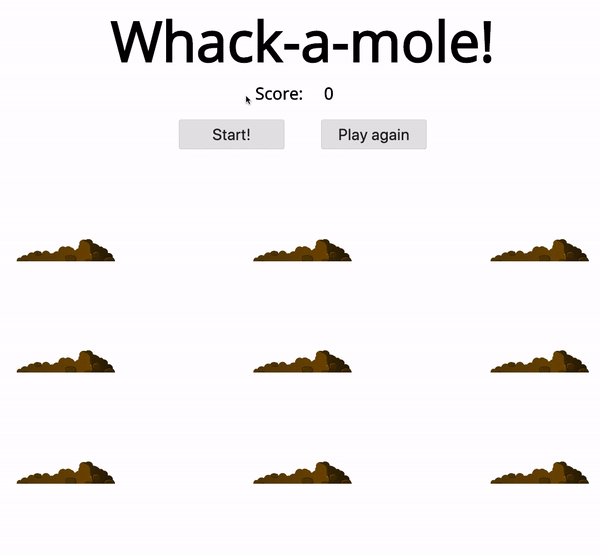

# 30. Whack a Mole

#### _Whack a Mole by JavaScript30 11/2/19_

## Description
This is Whack a Mole, 30th application out of 30 by 30 day Vanilla JavaScript Coding Challenge by Wes Bos.<br>
Please check the challenge from [JavaScript30](http://wesbos.com/javascript30/).



## About this Application
- Create a Whack a Mole game.

- A mole will pop from a hole randomly and peek out from the mole for between 350ms to 800ms.
    - User can change this speed from line 29 of `main.js`.

- The game starts when a user hits the start button. The game length is 10 seconds.
    - User can change the game length from line 44 of `main.js`.


## Setup/Installation

1. Clone this repo:
```
$ git clone https://github.com/misakimichy/JS30-30-whack-a-mole.git
```

2. Navigate to the top level of the cloned directory.

3. Open index.html with your preferred web browser.

## Known Bugs
* No known bugs at this time.

## Support and contact details
 I welcome any feedbacks and comments: misaki.koonce@gmail.com

## Technologies Used
_Git, GitHub, HTML, CSS, Vanilla JavaScript

## License
Copyright © 2019 under the MIT License